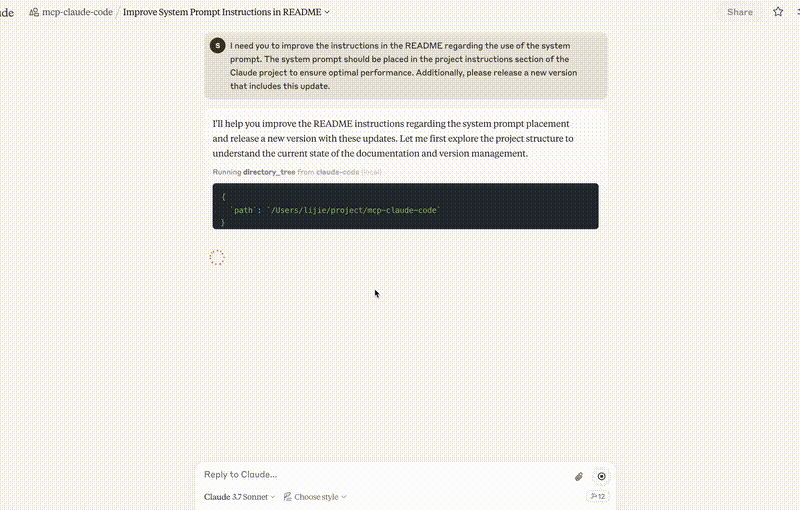

# MCP Claude Code

An implementation of Claude Code capabilities using the Model Context Protocol (MCP).

## Overview

This project provides an MCP server that implements Claude Code-like functionality, allowing Claude to directly execute instructions for modifying and improving project files. By leveraging the Model Context Protocol, this implementation enables seamless integration with various MCP clients including Claude Desktop.



## Features

- **Code Understanding**: Analyze and understand codebases through file access and pattern searching
- **Code Modification**: Make targeted edits to files with proper permission handling
- **Enhanced Command Execution**: Run commands and scripts in various languages with improved error handling and shell support
- **File Operations**: Manage files with proper security controls through shell commands
- **Code Discovery**: Find relevant files and code patterns across your project
- **Project Analysis**: Understand project structure, dependencies, and frameworks

## Tools Implemented

| Tool                   | Description                                                                                   |
| ---------------------- | --------------------------------------------------------------------------------------------- |
| `read_files`           | Read one or multiple files with encoding detection                                            |
| `write_file`           | Create or overwrite files                                                                     |
| `edit_file`            | Make line-based edits to text files                                                           |
| `directory_tree`       | Get a recursive tree view of directories                                                      |
| `get_file_info`        | Get metadata about a file or directory                                                        |
| `search_content`       | Search for patterns in file contents                                                          |
| `content_replace`      | Replace patterns in file contents                                                             |
| `run_command`          | Execute shell commands (also used for directory creation, file moving, and directory listing) |
| `run_script`           | Execute scripts with specified interpreters                                                   |
| `script_tool`          | Execute scripts in specific programming languages                                             |
| `project_analyze_tool` | Analyze project structure and dependencies                                                    |
| `think`                | Structured space for complex reasoning and analysis without making changes                    |

## Getting Started

### Usage

#### Configuring Claude Desktop

You can run it with `uvx run mcp-claude-code` without installation. Configure Claude Desktop to use this server by adding the following to your Claude Desktop configuration file:

```json
{
  "mcpServers": {
    "claude-code": {
      "command": "uvx",
      "args": [
        "--from",
        "mcp-claude-code",
        "claudecode",
        "--allow-path",
        "/path/to/your/project"
      ]
    }
  }
}
```

Make sure to replace `/path/to/your/project` with the actual path to the project you want Claude to access.

#### Advanced Configuration Options

You can customize the server using other options:你

```json
{
  "mcpServers": {
    "claude-code": {
      "command": "uvx",
      "args": [
        "--from",
        "mcp-claude-code",
        "claudecode",
        "--allow-path",
        "/path/to/project",
        "--name",
        "custom-claude-code",
        "--transport",
        "stdio"
      ]
    }
  }
}
```

### Configuring Claude Desktop System Prompt

To get the best experience with Claude Code, you need to add the provided system prompt to your Claude Desktop client. This system prompt guides Claude through a structured workflow for code modifications and project management.

Follow these steps:

1. Locate the system prompt file in this repository at `doc/system_prompt`
2. Open your Claude Desktop client
3. Create a new project or open an existing one
4. Navigate to the "Project instructions" section in the Claude Desktop sidebar
5. Copy the contents of `doc/system_prompt` and paste it into the "Project instructions" section
6. Replace `{project_path}` with the actual absolute path to your project

The system prompt provides Claude with:

- A structured workflow for analyzing and modifying code
- Best practices for project exploration and analysis
- Guidelines for development, refactoring, and quality assurance
- Special formatting instructions for mathematical content

This step is crucial as it enables Claude to follow a consistent approach when helping you with code modifications.

## Security

This implementation follows best practices for securing access to your filesystem:

- Permission prompts for file modifications and command execution
- Restricted access to specified directories only
- Input validation and sanitization
- Proper error handling and reporting

## Development

To contribute to this project:

1. Fork the repository
2. Create a feature branch (`git checkout -b feature/amazing-feature`)
3. Commit your changes (`git commit -m 'Add some amazing feature'`)
4. Push to the branch (`git push origin feature/amazing-feature`)
5. Open a Pull Request

## License

This project is licensed under the MIT License - see the LICENSE file for details.
